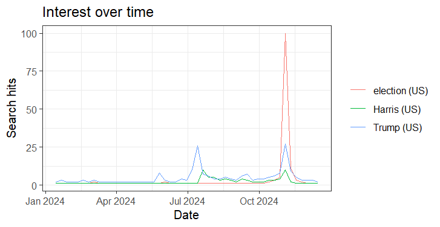

### A. Data Collection

To examine search interest related to the 2024 U.S. presidential election, I collected Google Trends data for the search terms *Trump*, *Kamala Harris*, and *Election* using two approaches:

1.  **Google Trends Website** On the [Google Trends website](https://trends.google.com/), I entered the three terms, set the location to the United States, and chose the custom time interval **January 15, 2024 to December 17, 2024**. This range covers the election process from the early primaries through Election Day. I downloaded the dataset as a CSV file.

2.  **R with gtrendsR Package** I installed and loaded the `gtrendsR` package in RStudio. Using the custom time range option, I ran:

    ``` r
    library(gtrendsR)

    TrumpHarrisElection <- gtrends(
      c("Trump", "Harris", "election"),
      geo = "US",
      gprop = "web",
      time = "2024-01-15 2024-12-17",
      onlyInterest = TRUE
    )

    the_df <- TrumpHarrisElection$interest_over_time
    write.csv(the_df, "TrumpHarrisElection.csv", row.names = FALSE)
    save(the_df, file = "TrumpHarrisElection.RData")
    ```

    This produced both CSV and RData files in my working directory.

### Google Trends Website Graph

```{=html}
<script type="text/javascript" src="https://ssl.gstatic.com/trends_nrtr/4215_RC01/embed_loader.js"></script>
```

```{=html}
<script type="text/javascript">
trends.embed.renderExploreWidget("TIMESERIES", {"comparisonItem":[{"keyword":"Trump","geo":"US","time":"2024-01-15 2024-12-17"},{"keyword":"Kamala Harris","geo":"US","time":"2024-01-15 2024-12-17"},{"keyword":"Election","geo":"US","time":"2024-01-15 2024-12-17"}],"category":0,"property":""}, {"exploreQuery":"date=2024-01-15%202024-12-17&geo=US&q=Trump,Kamala%20Harris,Election&hl=en","guestPath":"https://trends.google.com:443/trends/embed/"});
</script>
```

## R Plot



------------------------------------------------------------------------

### B. Data Characteristics

-   **Dates and Intervals:** For this eleven-month window, Google Trends aggregated the data by **week**. Each record shows the relative interest score (0–100) for a keyword in that week.

-   **Variables:**

    -   *Website*: CSV in wide format (columns for “Trump,” “Harris,” “Election”).
    -   *R*: Long format dataframe (columns include “date,” “hits,” “keyword”), which is easier to use programmatically.

------------------------------------------------------------------------

### C. Observed Interest Patterns

When reviewing the data, several clear patterns emerged:

-   **Trump** maintained consistently high search interest throughout 2024, often spiking around debates, major rallies, or controversial news stories.
-   **Harris** showed lower baseline interest compared to Trump, but her search volume rose sharply during key campaign events, especially after the Democratic National Convention and during the final weeks before the election.
-   **Election** as a search term followed the expected seasonal curve: modest early in the year, steadily increasing during the summer and fall, and peaking in early November around Election Day (Nov 5, 2024).

Overall, the patterns align with the media cycle: candidate-specific terms fluctuated depending on news coverage, while the general term “election” built momentum toward the decisive date.

------------------------------------------------------------------------

### D. Comparison of the Two Methods

1.  **Format of Data**

    -   *Website*: Wide format, better for manual inspection in Excel.
    -   *R*: Long format, better for coding and reshaping.

2.  **Flexibility**

    -   *Website*: Manual and intuitive but limited.
    -   *R*: Scriptable, reproducible, and allows more terms or time ranges to be added easily.

3.  **Granularity**

    -   *Website*: Gave weekly data for this range, with daily possible for shorter spans.
    -   *R*: Same rules as Google’s API; in this case, also weekly.

4.  **Output Options**

    -   *Website*: Only CSV.
    -   *R*: CSV, RData, and other formats directly usable in R.

5.  **Ease of Use**

    -   *Website*: Quick and user-friendly.
    -   *R*: Requires setup but far more efficient for repeated analysis.

------------------------------------------------------------------------

### E. Conclusion

-   Website: Fast, visual, perfect for a quick figure or sanity check.

-   R (gtrendsR): Reproducible, auditable, scalable, and better suited for serious data production & collection. You get tidy data, extra tables (regions, related queries), and full control over cleaning and analysis.

For this assignment, both routes produced consistent weekly series over the same 2024 window. The methodological advantages—reproducibility, parameter tracking, and scale—clearly favor R for research-grade work, while the website excels at quick exploration and presentation.

------------------------------------------------------------------------
